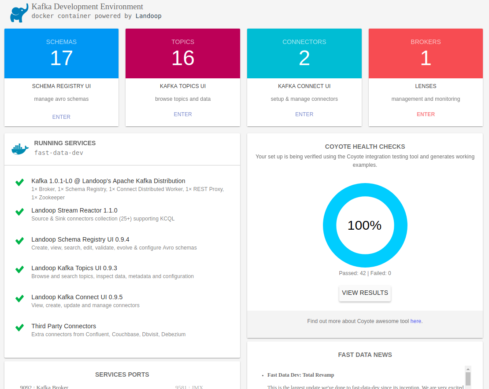
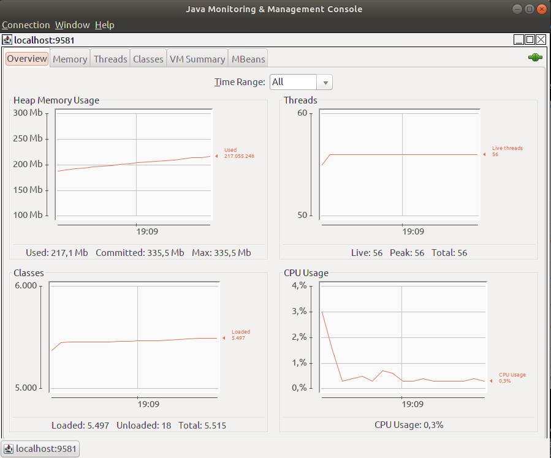
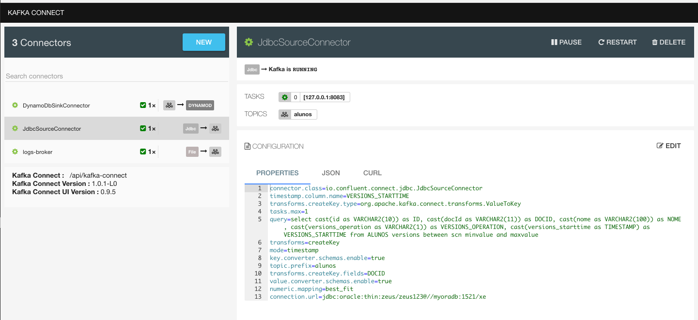
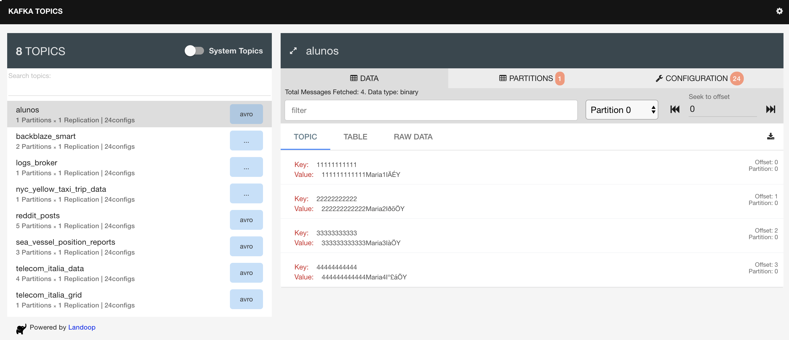
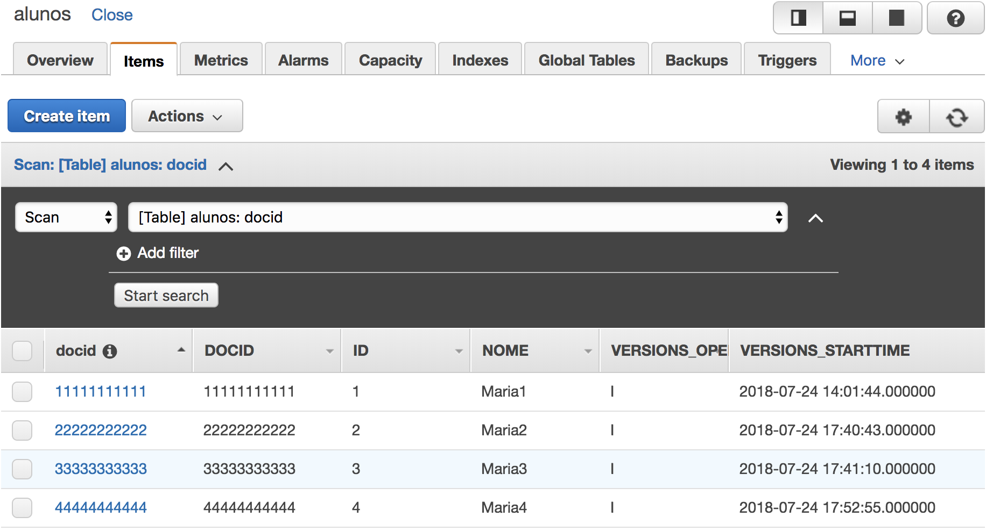

# Using Kafka connect to source from Oracle 12c and sink to DynamoDB
Ref: <https://github.com/asantos2000/kafka-connect-dynamodb>

## Connect My Oracle DB
Ref: <https://hub.docker.com/r/sath89/oracle-12c/>

Run `ora-start.sh`

To connect:

* hostname: localhost
* port: 1521
* sid: xe
* service name: xe
* username: system
* password: oracle

To connect using sqlplus:

`sqlplus system/oracle@//localhost:1521/xe`

Password for SYS & SYSTEM: `oracle`

Connect to Oracle Application Express web management console with the following settings:

* http://localhost:8080/apex
* workspace: INTERNAL
* user: ADMIN
* password: 0Racle$

## Creating the Oracle table
Go to [dynamoDB console](https://console.aws.amazon.com/dynamodb) and create `alunos` table.

### Creating user

Connect as admin:

```bash
./sqlplus.sh system/oracle@//localhost:1521/xe
```

```sql
CREATE USER zeus IDENTIFIED BY zeus123;

GRANT CONNECT TO zeus;
GRANT CONNECT, RESOURCE, DBA TO zeus;
GRANT CREATE SESSION TO zeus;
```

Connet as a regular user:

```bash
./sqlplus.sh zeus/zeus123@//localhost:1521/xe
```

Create table `alunos`

```sql
CREATE TABLE ALUNOS (ID VARCHAR2(10)  PRIMARY KEY, DOCID VARCHAR2(11), NOME VARCHAR2(100));
```

Insert records to the table:

```sql
INSERT INTO alunos (id, docid, nome) VALUES ('1', '11111111111', 'Maria1');
INSERT INTO alunos (id, docid, nome) VALUES ('2', '22222222222', 'Maria2');
INSERT INTO alunos (id, docid, nome) VALUES ('3', '33333333333', 'Maria3');
INSERT INTO alunos (id, docid, nome) VALUES ('4', '44444444444', 'Maria4');
COMMIT;
```
> `myfiles/queries.sql`

The flashback query:

```sql
set linesize 300

select cast(id as VARCHAR2(10)) as ID, cast(docId as VARCHAR2(11)) as DOCID, cast(nome as VARCHAR2(100)) as NOME, cast(versions_operation as VARCHAR2(1)) as VERSIONS_OPERATION, cast(versions_starttime as TIMESTAMP) as VERSIONS_STARTTIME from ALUNOS versions between scn minvalue and maxvalue;

ID         DOCID       NOME                        V VERSIONS_STARTTIME
---------- ----------- --------------------------- - ----------------------------
1          11111111111 Maria1
4          44444444444 Maria4                      I 24-JUL-18 05.52.55.000000 PM
3          33333333333 Maria3                      I 24-JUL-18 05.41.10.000000 PM
2          22222222222 Maria2                      **I** 24-JUL-18 05.40.43.000000 PM
```

## Starting kafka cluster for development
Ref: <https://github.com/Landoop/fast-data-dev>

### Installing JDBC for oracle

1. Go to Oracle wbe site: [Oracle Database 12.1.0.2 JDBC Driver & UCP Downloads](http://www.oracle.com/technetwork/database/features/jdbc/jdbc-ucp-122-3110062.html)
2. Download [ojdbc8.jar](http://www.oracle.com/technetwork/database/features/jdbc/jdbc-ucp-122-3110062.html)
3. Copy ojdbc8.jar to `./connect` folder;

```bash
kafka-start.sh
``` 
Follow start up progress through UI <http://localhost:3030/>



The default ports are:

* `9092` : Kafka Broker (9581 : JMX)
* `8081` : Schema Registry (9582 : JMX)
* `8082` : Kafka REST Proxy (9583 : JMX)
* `8083` : Kafka Connect Distributed (9584 : JMX)
* `2181` : ZooKeeper (9585 : JMX)
* `3030` : Web Server

An example of access the JMX console (java required): 

`jconsole localhost:9581`



or run docker directly

```bash
docker run \
 --rm \
 --name kafka \
 -h kafka \
 --network my-net \
 -p 2181:2181 \
 -p 3030:3030 \
 -p 8081-8083:8081-8083 \
 -p 9581-9585:9581-9585 \
 -p 9092:9092 \
 -e ADV_HOST=127.0.0.1 \
 -e RUNTESTS=0 \
 -v $PWD/connect/kafka-connect-dynamodb-0.3.0-SNAPSHOT-standalone.jar:/connectors/dynamodb.jar \
 -v $PWD/connect/ojdbc8.jar:/opt/landoop/connectors/third-party/kafka-connect-jdbc/ojdbc8.jar \
 -v $PWD/myfiles:/myfiles \
 -v $PWD/myfiles/data:/data \
 -v $PWD/myfiles/logs:/var/log \
 landoop/fast-data-dev
```
After a minute or so, kafka is ready.

## Configuring the JDBC connector
Ref: <https://docs.confluent.io/current/connect/connect-jdbc/docs/index.html>

Open the UI, and choose [Connectors](http://localhost:3030/kafka-connect-ui)



Hit the [New](http://localhost:3030/kafka-connect-ui/#/cluster/fast-data-dev/select-connector) button and copy and paste the following configuration:

Edit your DB credentials.

```ini
name=JdbcSourceConnector
connector.class=io.confluent.connect.jdbc.JdbcSourceConnector
timestamp.column.name=VERSIONS_STARTTIME
transforms.createKey.type=org.apache.kafka.connect.transforms.ValueToKey
tasks.max=1
query=select cast(id as VARCHAR2(10)) as ID, cast(docId as VARCHAR2(11)) as DOCID, cast(nome as VARCHAR2(100)) as NOME, cast(versions_operation as VARCHAR2(1)) as VERSIONS_OPERATION, cast(versions_starttime as TIMESTAMP) as VERSIONS_STARTTIME from ALUNOS versions between scn minvalue and maxvalue
transforms=createKey
mode=timestamp
key.converter.schemas.enable=true
topic.prefix=alunos
transforms.createKey.fields=DOCID
value.converter.schemas.enable=true
connection.url=jdbc:oracle:thin:zeus/zeus123@//myoradb:1521/xe
```
> `connect-oracle-config.ini` file

Hit [Create] if there are no red error messages.

Or use curl (or postman) to send the configuration:

```bash
curl -X POST \
  http://localhost:3030/api/kafka-connect/connectors \
  -H 'Content-Type: application/json' \
  -H 'Accept: application/json' \
  -d '{
  "name": "JdbcSourceConnector",
  "config": {
    "connector.class": "io.confluent.connect.jdbc.JdbcSourceConnector",
    "timestamp.column.name": "VERSIONS_STARTTIME",
    "transforms.createKey.type": "org.apache.kafka.connect.transforms.ValueToKey",
    "tasks.max": "1",
    "query": "select cast(id as VARCHAR2(10)) as ID, cast(docId as VARCHAR2(11)) as DOCID, cast(nome as VARCHAR2(100)) as NOME, cast(versions_operation as VARCHAR2(1)) as VERSIONS_OPERATION, cast(versions_starttime as TIMESTAMP) as VERSIONS_STARTTIME from ALUNOS versions between scn minvalue and maxvalue",
    "transforms": "createKey",
    "mode": "timestamp",
    "key.converter.schemas.enable": "true",
    "topic.prefix": "alunos",
    "transforms.createKey.fields": "DOCID",
    "value.converter.schemas.enable": "true",
    "connection.url": "jdbc:oracle:thin:zeus/zeus123@//myoradb:1521/xe"
  }
}'
```

It'll return HTTP status 201 (Created).

## Configuring DynamoDB connector

Hit the [New](http://localhost:3030/kafka-connect-ui/#/cluster/fast-data-dev/select-connector) button and copy and paste the following configuration:

Edit your AWS credentials.

```ini
name=DynamoDbSinkConnector
connector.class=dynamok.sink.DynamoDbSinkConnector
transforms.convert_timestamp.field=VERSIONS_STARTTIME
transforms.createKey.type=org.apache.kafka.connect.transforms.ValueToKey
transforms.extract.field=DOCID
tasks.max=1
topics=alunos
top.key.attribute=docid
transforms=createKey,extract,convert_timestamp
secret.key=[hidden]
transforms.convert_timestamp.format=yyyy-MM-dd HH:mm:ss.SSSSSS
access.key.id=[hidden]
transforms.convert_timestamp.type=org.apache.kafka.connect.transforms.TimestampConverter$Value
transforms.extract.type=org.apache.kafka.connect.transforms.ExtractField$Key
transforms.convert_timestamp.target.type=string
transforms.createKey.fields=DOCID
region=us-east-1
```
> connect-dynamodb-config.ini

Hit [Create] if there are no red error messages.

Or use curl (or postman) to send the configuration:

```bash
curl -X POST \
  http://localhost:3030/api/kafka-connect/connectors \
  -H 'Content-Type: application/json' \
  -H 'Accept: application/json' \
  -d '{
  "name": "DynamoDbSinkConnector",
  "config": {
    "connector.class": "dynamok.sink.DynamoDbSinkConnector",
    "transforms.convert_timestamp.field": "VERSIONS_STARTTIME",
    "transforms.createKey.type": "org.apache.kafka.connect.transforms.ValueToKey",
    "transforms.extract.field": "DOCID",
    "tasks.max": "1",
    "topics": "alunos",
    "top.key.attribute": "docid",
    "transforms": "createKey,extract,convert_timestamp",
    "secret.key": "[hidden]",
    "transforms.convert_timestamp.format": "yyyy-MM-dd HH:mm:ss.SSSSSS",
    "access.key.id": "[hidden]",
    "transforms.convert_timestamp.type": "org.apache.kafka.connect.transforms.TimestampConverter$Value",
    "transforms.extract.type": "org.apache.kafka.connect.transforms.ExtractField$Key",
    "transforms.convert_timestamp.target.type": "string",
    "transforms.createKey.fields": "DOCID",
    "region": "us-east-1"
  }
}'
```

## Producing some messages

Run `kafka-shell.sh` or `docker exec -it kafka bash` to get in the container and run:

```bash
# Producer
kafka-avro-console-producer --broker-list localhost:9092 --topic alunos --property value.schema='{"type": "record","name": "ConnectDefault","namespace": "io.confluent.connect.avro","fields": [{"name": "ID","type": ["null","string"],"default": null},{"name": "DOCID","type": ["null","string"],"default": null},{"name": "NOME","type": ["null","string"],"default": null},{"name": "VERSIONS_OPERATION","type": ["null","string"],"default": null},{"name": "VERSIONS_STARTTIME","type": ["null",{"type": "long","connect.version": 1,"connect.name": "org.apache.kafka.connect.data.Timestamp","logicalType": "timestamp-millis"}],"default": null}]}'

# Copy and past each message and hit enter
{"ID":{"string":"1"},"DOCID":{"string":"11111111111"},"NOME":{"string":"Maria1"},"VERSIONS_OPERATION":{"string":"I"},"VERSIONS_STARTTIME":{"long":1532440904000}}
{"ID":{"string":"2"},"DOCID":{"string":"22222222222"},"NOME":{"string":"Maria2"},"VERSIONS_OPERATION":{"string":"I"},"VERSIONS_STARTTIME":{"long":1532454043000}}
{"ID":{"string":"3"},"DOCID":{"string":"33333333333"},"NOME":{"string":"Maria3"},"VERSIONS_OPERATION":{"string":"I"},"VERSIONS_STARTTIME":{"long":1532454070000}}
{"ID":{"string":"4"},"DOCID":{"string":"44444444444"},"NOME":{"string":"Maria4"},"VERSIONS_OPERATION":{"string":"I"},"VERSIONS_STARTTIME":{"long":1532454775000}}

# Consumer (on another window)
kafka-avro-console-consumer --bootstrap-server localhost:9092 --topic alunos --from-beginning
```

To send a batch of messages, put those messages in a file and run:

```bash
cd /myfiles

cat messages.txt | kafka-avro-console-producer --broker-list localhost:9092 --topic alunos --property value.schema='{"type": "record","name": "ConnectDefault","namespace": "io.confluent.connect.avro","fields": [{"name": "ID","type": ["null","string"],"default": null},{"name": "DOCID","type": ["null","string"],"default": null},{"name": "NOME","type": ["null","string"],"default": null},{"name": "VERSIONS_OPERATION","type": ["null","string"],"default": null},{"name": "VERSIONS_STARTTIME","type": ["null",{"type": "long","connect.version": 1,"connect.name": "org.apache.kafka.connect.data.Timestamp","logicalType": "timestamp-millis"}],"default": null}]}'
```

On Kafka UI Topics



Go to Dynamodb table, tab Items to see your records.

> If something goes wrong, check the Connector UI, hit on DynamoDbSinkConnector and TASKS to see the log.



## Tools
If you need to delete a topic:

```bash
./delete-topic.sh alunos
```
> Caution: There is no undo for this operation.

Log to kafka server shell:

```bash
./kafka-shell.sh
```

See oracle logs:

```bash
./ora-logs.sh
```

Start / stop oracle:

```bash
# Start
./ora-start.sh
# Stop
./ora-stop.sh
```

Connect to sqlplus:

```bash
# To access alunos table
./sqlplus.sh zeus/zeus123@//localhost:1521/xe

# To admin
./sqlplus.sh system/oracle@//localhost:1521/xe
```

## Let's talk about topics

After configuring the DynamoDB's connector, it'll create the topic listed on topics key at the config. If you need to customize this topic (for instance, to match the number of tasks) use the kafka-topic command before or after configure the connector.

```bash
# Create topic
kafka-topic --zookeeper localhost:2181 --topic alunos --partitions 1 --replication-factor 1
```

Enjoy!!